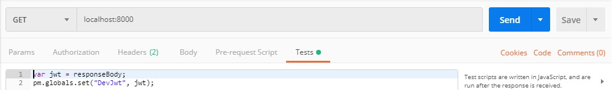

# JWT Quick Access
### Motivation
As working from the backend in D365 Talent, everytime when I need to test my endpoint from Postman, I have to include the Authorization header with JWT token that I get it from 
- Going to a Talent App
- Suddenly open the DevTools in Chrome, look at the networks panel, find out the request that contains Authorization header with JWT token
- Copy that token and paste it to my Postman request header

**However, this short live JWT token will be expired soon, which I think is super annoying. So I wrote this tool to have all the above steps done programmatically in one click, which helps me every hour, no copy and paste any more.**

### 5 Mins Setup Steps 
- **Have Chrome installed** in ``C:\Program Files (x86)\Google\Chrome\Application\chrome.exe``, which is the default path.
- **Node.js version 8+** and ``npm`` package manager. 
- **Clone this repo, and do ``npm install``**
- **Run the ``./setup.ps1``**, this will create a separated Chrome user data directory and an associated Chrome shortcut. You can customized it by ``.\setup.ps1 -dirpath C:\chrome-jwt-profile -shortcutname Chrome JWT.lnk``. Now you will have a brand new chrome browser session opened. Go to ``chrome://version/`` in your new chrome browser, make sure the Profile Path is what you specified or the default value ``C:\chrome-jwt-profile``.
- **Run the node script by ``npm start``**. Again you can customize it by ``$env:PORT="8000"; $env:CHROME_USER_DATA_DIR_PATH="C:/chrome-jwt-profile/"; npm start``.
- **In Postman, create a ``GET`` request to ``localhost:8000``. With following tests script and headers:**
```js
var jwt = responseBody;
pm.globals.set("DevJwt", jwt);
```

| Header                    | Value                                         |
|:-------------------------:|:---------------------------------------------:|
| web-page-url              |  https://attract.talent.dev.dynamics.com/jobs |
| xhr-url-keyword           |  flights                                      |
| header-name (Optional)    |  authorization                                |

Just like this:



- **Run the ``GET`` request above, a chrome browser will be opened, you need to signed in manually for the first time.**

- For Prod token, duplicate another request for Prod, with following tests script and headers, so that you get another global variable ``{{ProdJwt}}``.
```js
var jwt = responseBody;
pm.globals.set("ProdJwt", jwt);
```

| Header                    | Value                                         |
|:-------------------------:|:---------------------------------------------:|
| web-page-url              |  https://attract.talent.dynamics.com/jobs     |
| xhr-url-keyword           |  flights                                      |
| header-name (Optional)    |  authorization                                |

- **Your Postman now have 2 global variables ``{{DevJwt}}`` and ``{{ProdJwt}}``, you can send request to our DEV Talent endpoints like below:**


- **From now on everytime you get a 401, just send the ``GET`` request to your local running node app to refresh your ``{{DevJwt}}`` or ``{{ProdJwt}}`` with one click without copy and paste!**


#### Auto-Run in Background at Windows Start up
- Stop the original node app.
- ``npm install -g node-windows``
- ``npm install -g qckwinsvc``
- To plug the node app on Windows start up, ``qckwinsvc --name "JwtQuickAccess" --description "Jwt Quick Access" --script ".\jwt-quick-access.js" --startImmediately``
- To unplug, ``qckwinsvc --uninstall --name "JwtQuickAccess" --script ".\jwt-quick-access.js"``


### (Nitty-gritty) How it works with Chrome and Postman 
- Since we perhaps already signed in to the Talent App in our default browser session with existing cookies or whatever, I was thinking to open a new tab with Talent app URL in the same session using Puppetee or Selenium these kinds of web automation framwork, so I can access the XHR requests sent out from my signed-in Talent app.

- However, in order to launch a browser in any web automation framwork, you cannot have your default browser session opening, since it will need WRITE access to our default Chrome user data directory ``C:\Users\jel\AppData\Local\Google\Chrome\User Data\``, but that WRITE permission has been occupied by our running browser.

- So we need to create a totaly separated Chrome user data directory, and also create a Chrome shortcut to launch from that new user data directory. So then we can dictate our Node.js app to launch our Chrome with that new user data directory then go to a Talent App, and like what I planned to do, just access the one XHR request contains Authorization header with JWT token sent from my signed-in Talent app (Of course, for the first time you doing this, you need to manually signed in, but only once).

- The next step is to let Postman have the new JWT Token that we get from our Node.js app as a **Global Variable** in Postman. Super unfortunately, Postman only have a Newman CLI for setup global variables for a fixed set of requests collection, but not for the whole Postman app. And no npm package does the thing we want. Postman has Rest API that manage your Postman workspace in sync, but that is super heavy, slow and need additional setup. Plus, we cannot either write a config file in Postman application directory, because it doesn't set up the global variable by consuming the config file. 

- The only good thing is Postman can run a javascript which can set the global variable before or after a request has been sent, so I then had to make my node app as a local server that is constantly listening, and whenever we want to get a new JWT token, we sent a request to our local node app, and it will return the new JWT token in the body, so then we can setup the global variable with the Postman javascript afterwards.

- The xhr-url-keyword header is the keyword in the XHR request URL sent out from the web page. So this node app is not just for Talent App, it can consume any web page and any XHR request keyword, and any header (default: ``Authorization``).
